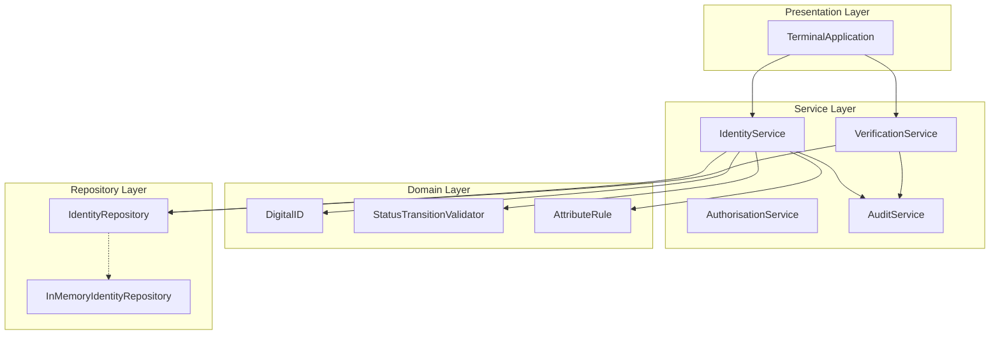
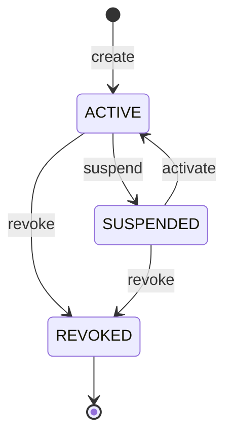
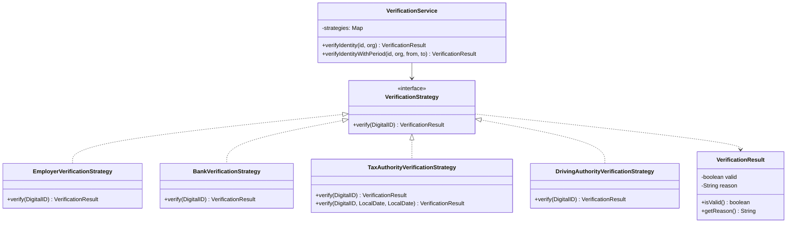
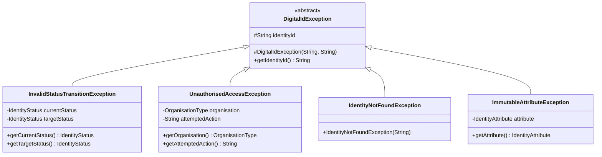

# IOT452U: Digital ID Platform

A console-based system for managing digital identities across an ecosystem of organisations.

## Repository

- **QMUL GitHub:** https://github.qmul.ac.uk/ec25996/IOT452U-Digital-ID
- **CI Mirror (GitHub Actions):** https://github.com/jtbinith/IOT452U-Digital-ID

## Prerequisites

- Java 17 or later
- Maven 3.6 or later

## How to Run

Build and run the application:

```bash
mvn compile -q && java -cp target/classes com.digitalid.app.TerminalApplication
```

Run all tests:

```bash
mvn clean test
```

## System Overview

The system allows a Central Authority to create, update and manage the status of digital identities. Consuming organisations (Tax Authority, Driving Authority, Bank, Employer) can verify identities but cannot modify them. Each organisation receives only the information relevant to their needs.

### Package Structure

```
src/main/java/com/digitalid/
├── app/                  # Presentation layer - console UI
├── service/              # Service layer - business logic orchestration
├── domain/               # Domain layer - entities, enums, validation rules
├── verification/         # Verification strategies per organisation type
├── repository/           # Data access layer - interface and implementation
├── audit/                # Audit logging of all system actions
├── exception/            # Custom exception hierarchy
└── util/                 # ID generation utility
```

### Architecture

The system follows a Domain-Centred Layered Architecture. Each layer has a single responsibility and primarily depends on the layers below it.



- **Presentation Layer** - handles console input/output and menu navigation. Contains no business logic.
- **Service Layer** - orchestrates operations, enforces authorisation and records audit events.
- **Domain Layer** - contains the core entities, status transition rules and attribute mutability rules.
- **Repository Layer** - abstracts data storage behind an interface, implemented with an in-memory store.

### Identity Lifecycle

Each Digital ID follows a defined state machine. REVOKED is a terminal state - no further transitions are allowed.



### Verification Strategy Pattern

Each consuming organisation verifies identities differently. The Strategy Pattern allows organisation-specific verification logic without modifying the core verification service.



- **Employer & Bank** - check if the identity is currently active.
- **Tax Authority** - checks active status and whether the identity was suspended during a given reporting period.
- **Driving Authority** - checks active status and whether the identity is subject to a restriction.

### Exception Hierarchy

Custom exceptions extend an abstract base class, providing specific error handling for different failure scenarios.



## Key Design Decisions

- **Domain-Centred Layered Architecture** - separates concerns so that domain logic is independent of the UI and storage mechanism. The service layer acts as a boundary, enforcing authorisation and audit logging before any domain operation.
- **Strategy Pattern** - each organisation has different verification requirements. Rather than using conditional logic, each organisation's rules are encapsulated in a dedicated strategy class. Adding a new organisation requires only a new strategy and an enum value - no changes to existing code (Open/Closed Principle).
- **Exception Hierarchy** - an abstract base class provides a common structure, while specific subclasses carry context relevant to each error type. This allows callers to catch specific exceptions or handle all domain errors generically.
- **Audit Logging** - all key actions are recorded with timestamp, organisation and outcome. The `AuditEventType` enum ensures event types are type-safe and consistent.

## Testing

52 JUnit 5 tests across 5 test files:

- **DigitalIDTest** - identity lifecycle, attribute updates, revoked state enforcement, status history
- **StatusTransitionValidatorTest** - valid and invalid state transitions
- **IdentityServiceTest** - service-level operations, authorisation rejection, audit recording
- **VerificationStrategyTest** - all four strategies including reporting period checks
- **VerificationServiceTest** - service orchestration, strategy selection, error handling

CI runs automatically on every push via GitHub Actions, executing `mvn clean test`.

## Technologies

- Java 17
- Maven
- JUnit 5
- GitHub Actions (CI/CD)
